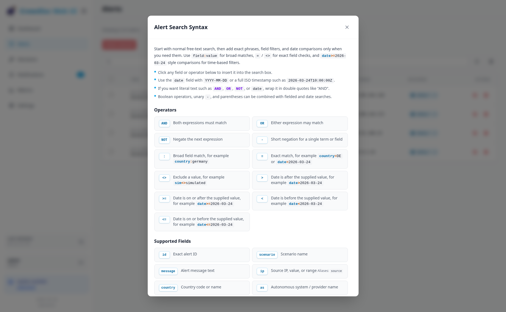
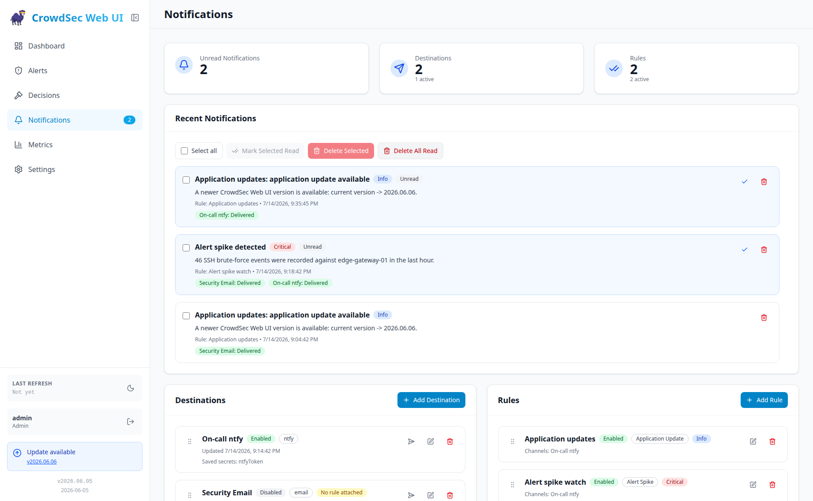
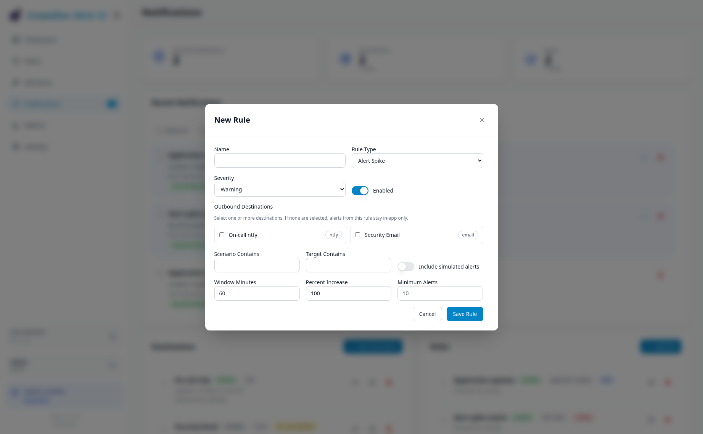
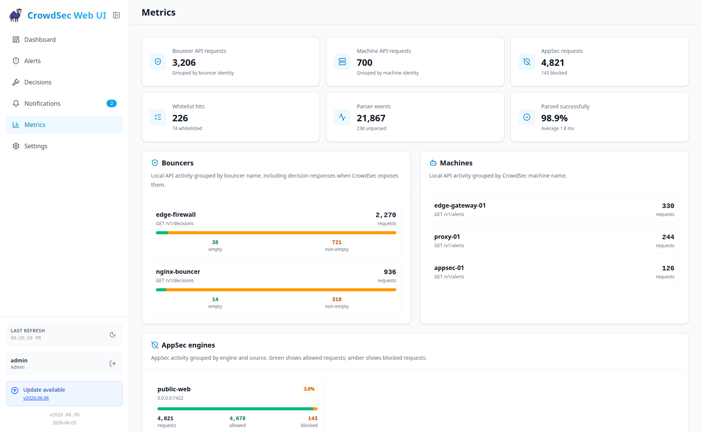
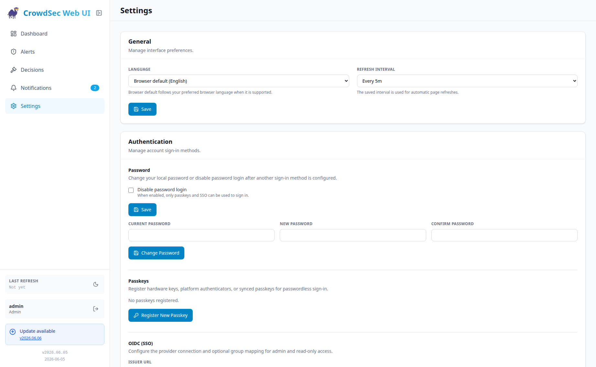

<div align="center">
  
</div>

<div align="center">

  [](https://github.com/TheDuffman85/crowdsec-web-ui/actions/workflows/release.yml)
  [](https://github.com/TheDuffman85/crowdsec-web-ui/actions/workflows/trivy-scan.yml)
  [](https://github.com/TheDuffman85/crowdsec-web-ui/blob/main/LICENSE)
  [](https://github.com/TheDuffman85/crowdsec-web-ui/commits/main)
  [](https://github.com/users/TheDuffman85/packages/container/package/crowdsec-web-ui)

</div>

# CrowdSec Web UI

A self-hosted web dashboard for [CrowdSec](https://crowdsec.net/) to review alerts, manage decisions, configure notifications, and optionally view runtime metrics.

<div align="center">
  <a href="https://react.dev/"></a>
  <a href="https://vite.dev/"></a>
  <a href="https://tailwindcss.com/"></a>
  <a href="https://nodejs.org/"></a>
  <a href="https://www.docker.com/"></a>
</div>

## Features

- **Dashboard**: total alerts, live active decisions, drilldowns, top lists, dynamic filtering, and simulation-mode counts when enabled.
- **Alerts and details**: searchable security-event history with simulation labels, attacker IP, AS, location map, and triggered-event breakdowns.
- **Decisions**: active/expired ban management, duplicate hiding, simulation filters, and the same unified search used on Alerts.
- **Manual actions**: add bans directly from the UI with custom duration and reason.
- **Runtime metrics**: optional Prometheus-backed views for bouncer and machine API activity, AppSec, parser flow, LAPI latency, parsing-time, and whitelist activity.
- **Performance and scale**: backend caching and optimized sync reduce resource pressure and support larger deployments with multiple machines or high alert/decision volumes.
- **Notifications**: rules for alert spikes, thresholds, new alerts/decisions, IP bans, recent CVEs, LAPI availability, and application updates; delivery to Email, Gotify, MQTT, ntfy, and Webhooks.
- **Unified search**: free text plus quoted phrases, `field:value`, `AND`, `OR`, `NOT`, unary `-`, parentheses, and page-specific help from the `Info` button.
- **Modern UI**: dark/light themes, responsive layouts, and fast React interactions.
- **Settings**: language, refresh cadence, password login, passkeys, and OIDC SSO in one page.
- **Localization**: Arabic, English, German, French, Hindi, Japanese, Portuguese, Spanish, Russian, and Chinese. Browser-default language affects the UI; an explicitly saved language also localizes server-generated sync and notification text. Browser-default server messages stay English because background jobs do not have browser locale context.
- **Authentication**: password login, passkeys, and OIDC SSO can protect the browser UI and protected API routes. New installs start with authentication enabled and initial admin setup; older migrated installs stay disabled until `AUTH_ENABLED=true`.

### Screenshots

<p>
  <a href="screenshots/dashboard.png"></a>
  <a href="screenshots/alerts.png"></a>
</p>
<p>
  <a href="screenshots/alert_details.png"></a>
  <a href="screenshots/search_syntax.png"></a>
</p>
<p>
  <a href="screenshots/decisions.png"></a>
  <a href="screenshots/add_decision.png"></a>
</p>
<p>
  <a href="screenshots/notifications.png"></a>
  <a href="screenshots/notification_rule.png"></a>
</p>
<p>
  <a href="screenshots/metrics.png"></a>
  <a href="screenshots/settings.png"></a>
</p>

> [!CAUTION]
> **Security Notice**: CrowdSec Web UI includes built-in authentication, but public deployments should still run behind HTTPS and a hardened reverse proxy. For centralized access control, configure OIDC SSO with an Identity Provider (IdP) such as [Authentik](https://goauthentik.io/), [Authelia](https://www.authelia.com/), or [Keycloak](https://www.keycloak.org/). Existing installs upgraded from versions without authentication remain unauthenticated until `AUTH_ENABLED=true` is set.
> Set `PERMISSION_READ_ONLY=true` to run an instance that can view data but cannot perform CrowdSec write actions or management actions such as changing refresh cadence, managing notification destinations/rules, sending notification tests, or deleting notifications. Language and marking notifications as read remain writable. This is an instance-wide safety mode, not user management or per-user RBAC.

## Architecture

- **Client**: React (Vite) + Tailwind CSS in `client/`; the build emits static assets to `dist/client`.
- **Server**: Node.js (Hono) in `server/`; the build emits compiled output to `dist/server`.
- **Cache/database**: SQLite (`better-sqlite3`) stores alerts, decisions, preferences, auth metadata, and notification state under `/app/data`.
- **CrowdSec integration**: the server authenticates to LAPI as a machine with watcher password auth or agent mTLS, then keeps a local cache updated with delta refreshes and chunked historical sync.
- **Container security**: the image runs as the non-root `node` user. Authentication can separately protect the browser UI and protected application API routes with password login, passkeys, and OIDC SSO.

See [API.md](API.md) for the application API reference, including auth behavior, route lists, query parameters, and request/response shapes.

## Related Projects

<table>
  <tr>
    <td width="80" align="center" valign="middle">
      <a href="https://github.com/TheDuffman85/linux-update-dashboard">
        
      </a>
    </td>
    <td valign="middle">
      <a href="https://github.com/TheDuffman85/linux-update-dashboard"><strong>Linux Update Dashboard</strong></a><br />
      A self-hosted web app for checking and applying Linux package updates across multiple servers from one browser dashboard.
    </td>
  </tr>
</table>

## Prerequisites

You need a running CrowdSec instance and exactly one CrowdSec LAPI authentication mode:

1. **Watcher password auth**
   Generate a password and register the Web UI machine:
   ```bash
   openssl rand -hex 32
   docker exec crowdsec cscli machines add crowdsec-web-ui --password <generated_password> -f /dev/null
   ```

2. **Agent mTLS auth**
   Configure CrowdSec LAPI TLS auth and generate an agent client certificate/key pair for this Web UI as described in the [CrowdSec TLS authentication docs](https://docs.crowdsec.net/docs/local_api/tls_auth/).

> [!NOTE]
> The `-f /dev/null` flag is crucial. It tells `cscli` **not** to overwrite the existing credentials file of the CrowdSec container. We only want to register the machine in the database, not change the container's local config.

> [!IMPORTANT]
> Choose exactly one auth mode:
> - Password auth: `CROWDSEC_USER` + either `CROWDSEC_PASSWORD` or `CROWDSEC_PASSWORD_FILE`
> - mTLS auth: `CROWDSEC_TLS_CERT_PATH` + `CROWDSEC_TLS_KEY_PATH` with optional `CROWDSEC_TLS_CA_CERT_PATH`
>
> Do not set both modes at the same time. The container will fail fast on mixed or partial auth configuration.

## Run with Docker (Recommended)

The examples below use only the required variables. Optional knobs are listed in [Environment Variables](#environment-variables).

1. **Build the image**:

   ```bash
   docker build -t crowdsec-web-ui .
   ```

   For forks or private registries, set the image reference used by update checks:
   ```bash
   docker build --build-arg DOCKER_IMAGE_REF=my-registry/my-image -t crowdsec-web-ui .
   ```

> [!NOTE]
> Current Docker images are based on Node.js rather than Bun, so the previous Bun/AVX-specific x64 runtime limitation no longer applies.

2. **Run the container** with the CrowdSec LAPI URL and one supported auth mode:

   ```bash
   docker run -d \
     --name crowdsec_web_ui \
     -p 3000:3000 \
     -e CROWDSEC_URL=http://<crowdsec-host>:8080 \
     -e CROWDSEC_USER=crowdsec-web-ui \
     -e CROWDSEC_PASSWORD=<your-secure-password> \
     -v $(pwd)/data:/app/data \
     --network your_crowdsec_network \
     crowdsec-web-ui
   ```

Ensure the container is on a Docker network that can reach `CROWDSEC_URL`.

### Docker Compose Example

```yaml
services:
  crowdsec-web-ui:
    image: ghcr.io/theduffman85/crowdsec-web-ui:latest
    container_name: crowdsec_web_ui
    ports:
      - "3000:3000"
    environment:
      - CROWDSEC_URL=http://crowdsec:8080
      - CROWDSEC_USER=crowdsec-web-ui
      - CROWDSEC_PASSWORD=<generated_password>
      # Optional CrowdSec Prometheus metrics endpoint
      # - CROWDSEC_PROMETHEUS_URL=http://crowdsec:6060/metrics
      # Authentication is enabled by default for new installs.
      # Existing data directories migrated from older versions keep auth disabled
      # until you explicitly set AUTH_ENABLED=true.
      # - AUTH_ENABLED=true
      # Optional deployment-wide date/time display settings
      # - TZ=Europe/Berlin
      # - CROWDSEC_TIME_FORMAT=24h
    volumes:
      - ./data:/app/data
    restart: unless-stopped
```

The repository also ships a minimal [`docker-compose.yml`](docker-compose.yml) that builds the image locally and reads the same runtime inputs from `.env`.

### Docker Compose Example (Docker Secrets)

Use `CROWDSEC_PASSWORD_FILE` instead of `CROWDSEC_PASSWORD` to read the CrowdSec watcher password from a Docker secret:

```yaml
services:
  crowdsec-web-ui:
    image: ghcr.io/theduffman85/crowdsec-web-ui:latest
    container_name: crowdsec_web_ui
    ports:
      - "3000:3000"
    environment:
      - CROWDSEC_URL=http://crowdsec:8080
      - CROWDSEC_USER=crowdsec-web-ui
      - CROWDSEC_PASSWORD_FILE=/run/secrets/crowdsec_password
      # - CROWDSEC_PROMETHEUS_URL=http://crowdsec:6060/metrics
    secrets:
      - crowdsec_password
    volumes:
      - ./data:/app/data
    restart: unless-stopped

secrets:
  crowdsec_password:
    file: ./secrets/crowdsec_password.txt
```

Create `./secrets/crowdsec_password.txt` before starting the container. Do not set both `CROWDSEC_PASSWORD` and `CROWDSEC_PASSWORD_FILE`.

### Docker Compose Example (mTLS Authentication)

```yaml
services:
  crowdsec-web-ui:
    image: ghcr.io/theduffman85/crowdsec-web-ui:latest
    container_name: crowdsec_web_ui
    ports:
      - "3000:3000"
    environment:
      - CROWDSEC_URL=https://crowdsec:8080
      - CROWDSEC_TLS_CERT_PATH=/certs/agent.pem
      - CROWDSEC_TLS_KEY_PATH=/certs/agent-key.pem
      # - CROWDSEC_PROMETHEUS_URL=http://crowdsec:6060/metrics
      # Optional when CrowdSec LAPI uses a private or self-signed CA
      # - CROWDSEC_TLS_CA_CERT_PATH=/certs/ca.pem
    volumes:
      - ./data:/app/data
      - /path/on/host/agent.pem:/certs/agent.pem:ro
      - /path/on/host/agent-key.pem:/certs/agent-key.pem:ro
      # - /path/on/host/ca.pem:/certs/ca.pem:ro
    restart: unless-stopped
```

## Environment Variables

### CrowdSec Connection and Authentication

Choose exactly one auth mode: password auth or mTLS auth.

| Variable | Default | Required | Description |
| --- | --- | --- | --- |
| `CROWDSEC_URL` | `http://crowdsec:8080` | Usually | CrowdSec LAPI base URL. Use `https://...` when TLS is enabled. |
| `CROWDSEC_USER` | none | Password auth only | CrowdSec machine/user name for watcher-password login. Must be set together with `CROWDSEC_PASSWORD` or `CROWDSEC_PASSWORD_FILE`. |
| `CROWDSEC_PASSWORD` | none | Password auth only | CrowdSec watcher password. Must be set together with `CROWDSEC_USER`. |
| `CROWDSEC_PASSWORD_FILE` | none | No | Optional Docker Secrets alternative: read `CROWDSEC_PASSWORD` from a file. Do not set both variables. |
| `CROWDSEC_TLS_CERT_PATH` | none | mTLS only | Path inside the container or host process to the client certificate used for CrowdSec mTLS auth. |
| `CROWDSEC_TLS_KEY_PATH` | none | mTLS only | Path to the client private key used for CrowdSec mTLS auth. |
| `CROWDSEC_TLS_CA_CERT_PATH` | none | No | Optional CA bundle used to verify the CrowdSec LAPI server certificate during mTLS connections. |

### Runtime Settings

| Variable | Default | Description |
| --- | --- | --- |
| `PORT` | `3000` | HTTP listen port. If you change this in Docker, also update port mappings and the container health check to match. |
| `BASE_PATH` | empty | Serve the UI under a path prefix such as `/crowdsec`. Start with `/` and omit the trailing slash. |
| `DB_DIR` | `/app/data` | Directory that stores the SQLite database and other persisted app data. If you change it, update your volume mounts too. |
| `TZ` | browser local | Optional deployment-wide IANA timezone, such as `Europe/Berlin` or `UTC`. When set, the UI, dashboard grouping, filters, and server-generated timestamps all use it. |
| `CROWDSEC_TIME_FORMAT` | browser locale | Optional deployment-wide clock format. Accepts `12h` or `24h`. When omitted, each browser's locale determines whether the UI uses a 12- or 24-hour clock. |
| `PERMISSION_READ_ONLY` | `false` | Set to `true` to hide management actions in the UI and reject API requests that add/delete decisions, delete alerts, clean up by IP, clear the cache, change refresh cadence, manage notification destinations/rules, send notification tests, or delete notifications. Language and marking notifications as read remain writable. |
| `AUTH_ENABLED` | new installs: `true`; migrated existing installs: `false` | Enables authentication for the UI and API. Set to `false` to run without login. Existing databases from older releases are marked disabled during migration so upgrades do not lock out current deployments. |
| `CROWDSEC_AUTH_SECRET` | auto-generated and persisted | Optional fixed secret used to sign session cookies and encrypt local auth secrets. If unset, the app generates one and stores it in app metadata. |
| `CROWDSEC_AUTH_SECRET_FILE` | auto-generated and persisted | Optional Docker Secrets alternative: read `CROWDSEC_AUTH_SECRET` from a file. Do not set both variables. |
| `CROWDSEC_AUTH_OIDC_ISSUER_URL` | none | Optional OIDC issuer URL. When set with `CROWDSEC_AUTH_OIDC_CLIENT_ID`, the login page shows SSO. Can also be configured from Settings. |
| `CROWDSEC_AUTH_OIDC_CLIENT_ID` | none | Optional OIDC client ID. Can also be configured from Settings. |
| `CROWDSEC_AUTH_OIDC_CLIENT_SECRET` | none | Optional OIDC client secret. Can also be configured from Settings. |
| `CROWDSEC_AUTH_OIDC_CLIENT_SECRET_FILE` | none | Optional Docker Secrets alternative: read `CROWDSEC_AUTH_OIDC_CLIENT_SECRET` from a file. Do not set both variables. |
| `CROWDSEC_AUTH_OIDC_SCOPE` | `openid profile email` | Optional OIDC authorization scope string. Must include `openid`. Can also be configured from Settings. |
| `CROWDSEC_AUTH_OIDC_GROUPS_CLAIM` | `groups` | Optional OIDC claim used for group mapping. The claim may be an array or a comma-separated string. Can also be configured from Settings. |
| `CROWDSEC_AUTH_OIDC_ADMIN_GROUPS` | empty | Optional comma-separated OIDC groups that receive admin permissions. Can also be configured from Settings. |
| `CROWDSEC_AUTH_OIDC_READ_ONLY_GROUPS` | empty | Optional comma-separated OIDC groups that receive read-only permissions. Can also be configured from Settings. |
| `CROWDSEC_AUTH_OIDC_UNMATCHED_ROLE` | `deny` | Controls OIDC users who match no configured admin or read-only group. Accepts `deny`, `admin`, or `read-only`. Can also be configured from Settings. |
| `CROWDSEC_LOOKBACK_PERIOD` | `168h` | Alert/history retention window used for sync and cleanup. Accepts values like `12h`, `7d`, or `30m`. |
| `CROWDSEC_REFRESH_INTERVAL` | `30s` | Normal background refresh interval. Accepts `0`, `manual`, `5s`, `30s`, `1m`, `5m`, or other `s`/`m`/`h`/`d` values. |
| `CROWDSEC_IDLE_REFRESH_INTERVAL` | `5m` | Refresh interval used when the app considers itself idle. |
| `CROWDSEC_IDLE_THRESHOLD` | `2m` | Inactivity period before the app switches to idle refresh behavior. |
| `CROWDSEC_FULL_REFRESH_INTERVAL` | `5m` | Interval for full cache refreshes while active. |
| `CROWDSEC_LAPI_REQUEST_TIMEOUT` | `30s` | Timeout for individual CrowdSec LAPI requests. Increase this for high-latency or very large CrowdSec datasets. |
| `CROWDSEC_PROMETHEUS_URL` | none | Optional CrowdSec Prometheus metrics endpoint. When unset, the Metrics page shows setup instructions; when set, it reads bouncer, machine, AppSec, parser, LAPI latency, and whitelist runtime metrics from this URL. |
| `CROWDSEC_PROMETHEUS_REQUEST_TIMEOUT` | `5s` | Timeout for individual Prometheus metrics requests. Accepts the same interval syntax as refresh settings. |
| `CROWDSEC_HEARTBEAT_INTERVAL` | `30s` | Interval for updating the Web UI machine heartbeat in CrowdSec. Use `0` or `manual` to disable heartbeat updates. |
| `CROWDSEC_ALERT_SYNC_CHUNK` | `6h` | Window size used when syncing historical alerts from LAPI. Smaller chunks reduce per-request payload size. |
| `CROWDSEC_ALERT_SYNC_MIN_CHUNK` | `15m` | Smallest window size used when retrying timed-out alert sync windows. |
| `CROWDSEC_BOOTSTRAP_RETRY_DELAY` | `30s` | Delay between background retries when initial CrowdSec bootstrap fails. |
| `CROWDSEC_BOOTSTRAP_RETRY_ENABLED` | `true` | Enables background bootstrap retry after startup or login failures. |
| `CROWDSEC_SIMULATIONS_ENABLED` | `false` | Include simulation-mode alerts and decisions from CrowdSec and expose the related UI indicators. |
| `CROWDSEC_ALERT_INCLUDE_ORIGINS` | empty | Comma-separated list of exact origins to include when syncing alerts. |
| `CROWDSEC_ALERT_EXCLUDE_ORIGINS` | empty | Comma-separated list of exact origins to drop after alert results are merged. |
| `CROWDSEC_ALERT_INCLUDE_CAPI` | `false` | Add the Central API / community-blocklist alert feed. |
| `CROWDSEC_ALERT_INCLUDE_ORIGIN_EMPTY` | `false` | Keep alerts whose effective origin is empty when using explicit include filters. |
| `CROWDSEC_ALERT_EXCLUDE_ORIGIN_EMPTY` | `false` | Drop alerts whose effective origin is empty. |
| `NOTIFICATION_SECRET_KEY` | auto-generated and persisted | Optional fixed encryption key for saved notification secrets. If unset, the app generates one and stores it in app metadata. |
| `NOTIFICATION_SECRET_KEY_FILE` | auto-generated and persisted | Optional Docker Secrets alternative: read `NOTIFICATION_SECRET_KEY` from a file. Do not set both variables. |
| `NOTIFICATION_ALLOW_PRIVATE_ADDRESSES` | `true` | Allow notification destinations on private, loopback, and link-local addresses. Set to `false` to block them. |
| `NOTIFICATION_DEBUG_PAYLOADS` | `false` | When enabled, failed notification deliveries log a truncated rendered request body for troubleshooting. Use carefully because payloads may contain sensitive data. |
| `NODE_EXTRA_CA_CERTS` | none | Optional Node.js trust bundle for HTTPS connections, useful when using password auth against a private or self-signed CrowdSec CA. |

### File-Backed Secrets

`CROWDSEC_PASSWORD_FILE`, `NOTIFICATION_SECRET_KEY_FILE`, `CROWDSEC_AUTH_SECRET_FILE`, and `CROWDSEC_AUTH_OIDC_CLIENT_SECRET_FILE` read their values from UTF-8 files, including Docker Secrets mounts under `/run/secrets`. For each setting, configure the direct variable or its `_FILE` alternative, not both. The app fails fast when both are set or when a configured file cannot be read. File-backed secrets are loaded during startup, so restart the app after rotating a mounted secret.

### Authentication

Authentication covers the browser UI and protected application API routes. The health endpoint remains public for container and reverse-proxy health checks. New installs start with authentication enabled and show an initial setup page where you create the first local administrator account. Upgraded installs with an existing SQLite database are migrated with authentication disabled by default, so existing deployments keep working until you opt in with:

```env
AUTH_ENABLED=true
```

Set `AUTH_ENABLED=false` to disable authentication. This setting is intentionally environment-controlled, not configurable from the UI.

Local password login is available after onboarding. Authenticated users can change their own password, add optional TOTP verification for password sign-in, and register or remove their own passkeys from Settings. TOTP setup shows a QR code, an authenticator-app setup link for mobile devices, and the manual setup key; once enabled, password login requires the current authenticator code after the password is accepted. Administrators can also disable password login and configure OIDC SSO from Settings. OIDC can also be preconfigured with environment variables:

```env
AUTH_ENABLED=true
CROWDSEC_AUTH_OIDC_ISSUER_URL=https://idp.example.com/application/o/crowdsec-web-ui/
CROWDSEC_AUTH_OIDC_CLIENT_ID=crowdsec-web-ui
CROWDSEC_AUTH_OIDC_CLIENT_SECRET=change-me
CROWDSEC_AUTH_OIDC_SCOPE="openid profile email"
CROWDSEC_AUTH_OIDC_GROUPS_CLAIM=groups
CROWDSEC_AUTH_OIDC_ADMIN_GROUPS=crowdsec-admins,secops
CROWDSEC_AUTH_OIDC_READ_ONLY_GROUPS=crowdsec-viewers
CROWDSEC_AUTH_OIDC_UNMATCHED_ROLE=deny
```

OIDC Settings accepts the issuer URL, client ID, client secret, authorization scopes, groups claim, admin groups, read-only groups, and the unmatched-user policy. Saved Settings values override OIDC environment defaults. Authorization scopes must include `openid`; add provider-specific scopes such as `groups` only when your IdP requires them for the configured groups claim. By default, OIDC users who match no configured group are denied. Set the unmatched-user policy to `admin` or `read-only` only when every user who can complete OIDC sign-in should receive that fallback role.

OIDC group mapping is lightweight RBAC. `PERMISSION_READ_ONLY=true` is still instance-wide and overrides user roles. For OIDC, admin group matches get full access, read-only group matches can view data and keep allowed preferences, and users with no matching group follow `CROWDSEC_AUTH_OIDC_UNMATCHED_ROLE`.

### Build and Image Metadata

These values are mainly relevant when building your own image or local production bundle.

| Variable | Default | Description |
| --- | --- | --- |
| `DOCKER_IMAGE_REF` | `theduffman85/crowdsec-web-ui` | Image reference used by the built-in update checker. Accepts `owner/repo` or registry-prefixed forms such as `ghcr.io/owner/repo`. |
| `VITE_VERSION` | `0.0.0` | Version label shown in the UI and used for update-check comparisons. |
| `VITE_BRANCH` | `main` | Branch label shown in the UI. `dev` enables dev-build update comparisons. |
| `VITE_COMMIT_HASH` | empty | Commit hash displayed in the sidebar and used for build metadata/update logic. |
| `VITE_BUILD_DATE` | auto-generated at build time | Build timestamp shown in the UI. |
| `VITE_REPO_URL` | `https://github.com/TheDuffman85/crowdsec-web-ui` | Repository URL used for release and commit links in the UI. |

### Development and Test Only

| Variable | Default | Description |
| --- | --- | --- |
| `BACKEND_URL` | `http://localhost:3000` | Vite dev-server proxy target for `/api` during local frontend development. |
| `CROWDSEC_MTLS_IMAGE` | `crowdsecurity/crowdsec:latest` | Override image used by `pnpm run test:mtls:crowdsec`. |
| `CROWDSEC_MTLS_KEEP` | `0` | Set to `1` to keep the disposable CrowdSec test container after the mTLS smoke test. |
| `CROWDSEC_MTLS_CONTAINER` | auto-generated | Override the disposable container name used by the mTLS smoke test. |

> [!NOTE]
> `scripts/ensure-native-deps.mjs` also honors standard Node/npm cache variables such as `COREPACK_HOME`, `XDG_CACHE_HOME`, `PREBUILD_INSTALL_CACHE`, `npm_config_cache`, `npm_config_devdir`, and `npm_config_nodedir`. Those are generic toolchain settings rather than project-specific configuration, so they are not required for normal setup.

## Deployment Notes

### Trusted IPs for Delete Operations (Optional)

By default, CrowdSec may restrict certain write operations such as deleting alerts to trusted IP addresses. If you encounter `403 Forbidden` errors when trying to delete alerts, add the Web UI network or IP range to CrowdSec's trusted IPs list.

**Docker Setup**: Add the Web UI container's network to the CrowdSec configuration in `/etc/crowdsec/config.yaml` or via environment variable:

```yaml
api:
  server:
    trusted_ips:
      - 127.0.0.1
      - ::1
      - 172.16.0.0/12  # Docker default bridge network
```

Or using `TRUSTED_IPS` environment variable on the CrowdSec container:

```bash
TRUSTED_IPS="127.0.0.1,::1,172.16.0.0/12"
```

See the [CrowdSec documentation](https://docs.crowdsec.net/docs/local_api/intro/) for more details on LAPI configuration.

### Using CrowdSec Web UI with a Local or Custom Certificate

If CrowdSec LAPI uses HTTPS with a self-signed certificate or internal CA, the Web UI may fail with:

```
Login failed: unable to get local issuer certificate
```

Mount the CA certificate and point Node.js at it with `NODE_EXTRA_CA_CERTS`:

```yaml
services:
  crowdsec-web-ui:
    image: ghcr.io/theduffman85/crowdsec-web-ui:latest
    container_name: crowdsec_web_ui
    ports:
      - "3000:3000"
    environment:
      - CROWDSEC_URL=https://crowdsec:8080
      - CROWDSEC_USER=crowdsec-web-ui
      - CROWDSEC_PASSWORD=<generated_password>
      - NODE_EXTRA_CA_CERTS=/certs/root_ca.crt
    volumes:
      - ./data:/app/data
      - /path/on/host/root_ca.crt:/certs/root_ca.crt:ro
    restart: unless-stopped
```

Replace `/path/on/host/root_ca.crt` with your CA file path and keep the mount read-only. This avoids rebuilding the image. For mTLS auth, prefer `CROWDSEC_TLS_CA_CERT_PATH` as the explicit CrowdSec LAPI trust input.

### Reverse Proxy with Base Path

Use `BASE_PATH` to serve the Web UI under a non-root path such as `https://example.com/crowdsec/`:

```yaml
services:
  crowdsec-web-ui:
    image: ghcr.io/theduffman85/crowdsec-web-ui:latest
    container_name: crowdsec_web_ui
    ports:
      - "3000:3000"
    environment:
      - CROWDSEC_URL=http://crowdsec:8080
      - CROWDSEC_USER=crowdsec-web-ui
      - CROWDSEC_PASSWORD=<generated_password>
      - BASE_PATH=/crowdsec
    volumes:
      - ./data:/app/data
    restart: unless-stopped
```

Nginx example:

```nginx
location /crowdsec/ {
    proxy_pass http://localhost:3000/crowdsec/;
    proxy_http_version 1.1;
    proxy_set_header Host $host;
    proxy_set_header X-Real-IP $remote_addr;
    proxy_set_header X-Forwarded-For $proxy_add_x_forwarded_for;
    proxy_set_header X-Forwarded-Proto $scheme;
}
```

`BASE_PATH` must start with `/` and must not include a trailing slash. When set, `/` redirects to the base path and all API calls, assets, and navigation use it automatically.

### Health Check

The image includes a `HEALTHCHECK` for `GET /api/health`, which does not require authentication. Startup is non-blocking: if CrowdSec LAPI is temporarily unavailable, the Web UI stays up and retries bootstrap in the background, so the container can become healthy before the first sync completes.

**Endpoint:** `GET /api/health` (no authentication required)

```bash
curl http://localhost:3000/api/health
# {"status":"ok"}
```

The built-in check runs every 30 seconds with a 10-second start period. Check Docker health with:

```bash
docker inspect --format='{{.State.Health.Status}}' crowdsec_web_ui
```

If you use `BASE_PATH`, the health check still targets `localhost:3000/api/health` directly inside the container, so no additional configuration is needed. If you change `PORT`, update the health check command in your deployment to match.

## Runtime Behavior

### Prometheus Metrics Page

The Metrics page shows setup guidance until `CROWDSEC_PROMETHEUS_URL` is set. Once configured, it reads CrowdSec's Prometheus endpoint for runtime observability: bouncer and machine LAPI activity, AppSec requests/blocks, parser and datasource activity, LAPI request latency, parsing timing, and whitelist hits.

The page intentionally avoids duplicating alert and decision analytics that are already covered by the main app dashboard and tables. Values come from the current raw Prometheus scrape, so the UI avoids CrowdSec metrics that only become useful with Grafana-style time-window `rate()` or `increase()` queries.

CrowdSec documents the endpoint at `http://127.0.0.1:6060/metrics` by default. To expose the bouncer, machine, AppSec, whitelist, and per-node parser details used by this page, enable Prometheus metrics in CrowdSec with `level: full` in `/etc/crowdsec/config.yaml`:

```yaml
prometheus:
  enabled: true
  level: full
  listen_addr: 127.0.0.1
  listen_port: 6060
```

If CrowdSec and the Web UI run in different containers, bind the CrowdSec metrics listener to an address reachable from the Web UI container and keep it on a trusted network. For example, in a Compose network you might use:

```yaml
prometheus:
  enabled: true
  level: full
  listen_addr: 0.0.0.0
  listen_port: 6060
```

Then point the Web UI at that endpoint:

```yaml
environment:
  - CROWDSEC_PROMETHEUS_URL=http://crowdsec:6060/metrics
```

`level: aggregated` works with less detail because it omits per-machine/per-bouncer LAPI metrics and per-node parser metrics. AppSec and LAPI latency sections also depend on whether the corresponding CrowdSec Prometheus metrics are emitted by your deployment. `level: none` disables metrics registration.

Reference: [CrowdSec Prometheus documentation](https://docs.crowdsec.net/docs/next/observability/prometheus/).

### Simulation Mode Visibility

CrowdSec simulation mode generates alerts and decisions without live remediation. `CROWDSEC_SIMULATIONS_ENABLED=false` by default. Set it to `true` to fetch simulated data and show simulation badges, filters, and dashboard counts; leave it unset or `false` to hide simulated alerts/decisions and avoid requesting them from LAPI.

### Table Column Visibility

The Alerts and Decisions tables include a Columns button. Column layouts are saved in the browser's local storage, so each browser profile can keep its own table layout. `ID`, `Machine`, and `Origin` are hidden by default; `Machine` prefers `machine_alias` and falls back to `machine_id`; alerts with multiple decision origins show `Mixed`. Hidden columns remain searchable with advanced fields such as `id:`, `machine:`, and `origin:`.

### Search Syntax

The Alerts and Decisions pages use a single search box that supports both normal free-text search and optional advanced syntax.

- Plain words: `ssh hetzner`
- Quoted phrases: `"nginx bf"`
- Fielded search: `country:germany`, `status:active`
- Date comparisons: `date>=2026-03-24`, `date<2026-03-25T12:00:00Z`
- Exact/negative checks: `country=DE`, `sim<>simulated`, `-sim:simulated`
- Boolean logic and grouping: `AND`, `OR`, `NOT`, `country:(germany OR france)`

Examples:

- Alerts: `country:germany ssh`
- Alerts: `date>=2026-03-24 AND date<2026-03-25`
- Alerts: `country:(germany OR france) AND -sim:simulated`
- Decisions: `status:active AND action:ban`
- Decisions: `date>=2026-03-24 AND action:ban`
- Decisions: `alert:123 OR ip:"192.168.5.0/24"`

A field name by itself, such as `country`, is free text unless followed by `:`. Ordered comparisons (`<`, `>`, `<=`, `>=`, `=>`) are supported for `date`. To search literal operator words like `AND`, `OR`, or `NOT`, wrap them in double quotes. Use the `Info` button beside the search field for page-specific fields and examples.

### Alert Source Filtering

Use alert source filters when CrowdSec ingests large volumes from automation, imported blocklists, or community feeds and you want the Web UI cache to focus on specific origins.

Configuration:

- `CROWDSEC_ALERT_INCLUDE_ORIGINS`: comma-separated list of exact origins to include when syncing alerts
- `CROWDSEC_ALERT_EXCLUDE_ORIGINS`: comma-separated list of exact origins that cause a synced alert to be dropped
- `CROWDSEC_ALERT_INCLUDE_CAPI`: set to `true` to include Central API / community blocklist alerts
- `CROWDSEC_ALERT_INCLUDE_ORIGIN_EMPTY`: set to `true` to also include alerts whose effective origin is empty when using explicit include filters
- `CROWDSEC_ALERT_EXCLUDE_ORIGIN_EMPTY`: set to `true` to drop alerts whose effective origin is empty

```yaml
environment:
  - CROWDSEC_ALERT_INCLUDE_ORIGINS=crowdsec,cscli-import
  - CROWDSEC_ALERT_EXCLUDE_ORIGINS=cscli
  - CROWDSEC_ALERT_INCLUDE_CAPI=true
  - CROWDSEC_ALERT_INCLUDE_ORIGIN_EMPTY=true
  - CROWDSEC_ALERT_EXCLUDE_ORIGIN_EMPTY=false
```

Behavior: without source vars, the Web UI fetches the normal non-CAPI/non-lists alert feed. Include origins are pushed upstream where possible. `CROWDSEC_ALERT_INCLUDE_CAPI=true` adds the dedicated CAPI/community-blocklist query unless explicit include filters are also set. Empty-origin include/exclude handling and generic excludes are local because CrowdSec LAPI does not expose those filters. If an alert contains any excluded origin, the whole alert is dropped. Origin checks prefer associated decision origins and fall back to CrowdSec blocklist/list source scopes for alerts without decisions.

Common origins:

- `crowdsec` for alerts carrying decisions created by the security engine
- `cscli` for alerts created by manual `cscli decisions add`
- `cscli-import` for alerts created by `cscli decisions import`
- `lists` for imported list feeds
- `CAPI` for Central API / community blocklist alerts

Examples:

- `CROWDSEC_ALERT_INCLUDE_ORIGINS=crowdsec` keeps only security-engine alerts
- `CROWDSEC_ALERT_INCLUDE_ORIGINS=lists` fetches only list-based alerts
- `CROWDSEC_ALERT_INCLUDE_CAPI=true` keeps the default non-CAPI feed and adds CAPI/community-blocklist alerts; `CROWDSEC_ALERT_INCLUDE_ORIGINS=CAPI` fetches only CAPI/community-blocklist alerts
- `CROWDSEC_ALERT_INCLUDE_ORIGINS=crowdsec` with `CROWDSEC_ALERT_INCLUDE_ORIGIN_EMPTY=true` keeps `crowdsec` alerts and alerts without an origin
- `CROWDSEC_ALERT_INCLUDE_ORIGINS=cscli` with `CROWDSEC_ALERT_INCLUDE_ORIGIN_EMPTY=true` keeps `cscli` alerts and alerts without an origin
- `CROWDSEC_ALERT_EXCLUDE_ORIGIN_EMPTY=true` removes alerts without an effective origin from the synced cache
- `CROWDSEC_ALERT_EXCLUDE_ORIGINS=cscli,lists` removes manual `cscli` alerts and imported list alerts from the local synced cache view

Because the local decisions view is built from synced alerts, these settings also affect which imported decisions appear in the UI.

## Notifications

The **Notifications** page defines rules over locally cached CrowdSec data. Matching rules create in-app notifications, record delivery status, and can send outbound messages to one or more destinations.

### Rules

Every rule has a name, severity (`info`, `warning`, `critical`), incident-based deduplication, and one or more destination channels. Alert-based rules can filter scenario text, target text, and simulated alerts. `IP Ban` and `New Alert/Decision` rules also support exact IP and CIDR filters.

| Rule type | Behavior |
| --- | --- |
| `Alert Spike` | Compares the current window with the previous window and triggers when percentage increase and minimum alert count are exceeded. |
| `Alert Threshold` | Triggers when matching alerts in the configured time window reach the threshold. |
| `New Alert/Decision` | Creates one notification for every matching alert, decision, or both within the lookback window. Includes record ID, timestamps, scenario, target, source/value, and related alert/decision details. Stable per-record deduplication prevents repeats. |
| `IP Ban` | Triggers once for each active ban decision in the configured window, supports exact IP/CIDR filters, and deduplicates duplicate active decision rows for the same ban. |
| `Recent CVE` | Extracts CVE IDs from matching alerts and checks publication age before notifying. |
| `LAPI Availability` | Triggers when CrowdSec LAPI stays unavailable past the outage threshold, with optional recovery notifications. |
| `Application Update` | Uses the built-in update check and triggers when a newer CrowdSec Web UI version is available. |

> [!NOTE]
> The `Recent CVE` rule queries the NVD API to determine when a CVE was published. If outbound access to `services.nvd.nist.gov` is blocked, recent-CVE notifications may be skipped.

### Destinations

You can enable/disable destinations independently and attach the same rule to several destinations. Saved secrets are masked in the UI and encrypted at rest with `NOTIFICATION_SECRET_KEY`, or with an auto-generated key persisted in app metadata. **Send Test** validates a saved destination immediately. Delivery results are stored as `delivered` or `failed`. Private, loopback, and link-local destinations are allowed by default and can be blocked with `NOTIFICATION_ALLOW_PRIVATE_ADDRESSES=false`.

| Destination | Settings |
| --- | --- |
| Email | SMTP host/port/security (`Plain SMTP`, `STARTTLS`, `SMTPS / Implicit TLS`), optional user/password, from address, comma-separated recipients, importance (`auto`, `normal`, `important`), and optional insecure TLS for trusted self-signed SMTP endpoints. Auto importance maps `info` to `normal` and `warning`/`critical` to `important`. |
| Gotify | Gotify URL, app token, and priority (`auto` or explicit integer). Auto priority maps `info` to `5`, `warning` to `7`, and `critical` to `10`. |
| ntfy | Server URL, topic, optional access token, and priority (`auto`, `min`, `low`, `default`, `high`, `urgent`). Auto priority maps `info` to `default`, `warning` to `high`, and `critical` to `urgent`. |
| MQTT | Generic publish-only output with broker URL, optional username/password/client ID, QoS `0` or `1`, keepalive, connect timeout, topic, and retain flag. It does not include Home Assistant discovery, entity sync, or command handling. |
| Webhook | Custom HTTP delivery with method (`POST`, `PUT`, `PATCH`), URL, optional query parameters/headers, auth (none, bearer token, or basic auth), body mode (`JSON`, `Text`, `Form`), timeout, retries, retry delay, and optional insecure TLS for trusted self-signed HTTPS endpoints. |

MQTT publishes JSON with `title`, `message`, `severity`, `metadata`, `sent_at`, `channel_id`, `channel_name`, `channel_type`, `rule_id`, `rule_name`, and `rule_type`. Test sends use `rule_id=test`, `rule_name=Test notification`, and `rule_type=test`.

Webhook templates support dotted `event.*` variables in bodies and templated fields. Available fields include `title`, `message`, `severity`, `metadata`, `sent_at`, `channel_name`, `rule_id`, `rule_name`, and `rule_type`, each with a `*Json` variant for unquoted JSON insertion. Nullable rule fields also provide `OrUnknown` and `OrUnknownJson` aliases. Failed webhook deliveries record the HTTP status and a truncated response body; `NOTIFICATION_DEBUG_PAYLOADS=true` also logs a truncated rendered request body, with sensitive form fields redacted.

Notification titles and bodies are localized when the global language selector is set to a specific language. With **Browser default**, outbound notification content is generated in English because server jobs do not have access to the browser locale.

### Notification Security Controls

`NOTIFICATION_SECRET_KEY` can override the destination-secret encryption key; otherwise the backend generates one on first start and persists it in app metadata. `NOTIFICATION_SECRET_KEY_FILE` reads that key from a mounted file. `NOTIFICATION_ALLOW_PRIVATE_ADDRESSES=true` allows private, loopback, and link-local destinations; set it to `false` to block them. `NOTIFICATION_DEBUG_PAYLOADS=false` should only be set to `true` temporarily while troubleshooting failed deliveries.

### Current Scope

The notification system supports in-app notification history, rule-based outbound delivery, and Email, Gotify, MQTT, ntfy, and Webhook destinations. It does **not** currently include Telegram, Home Assistant MQTT discovery, MQTT entity state publishing, or inbound commands.

### Run with Helm

A Helm chart for deploying `crowdsec-web-ui` on Kubernetes is available (maintained by the zekker6):
[https://github.com/zekker6/helm-charts/tree/main/charts/apps/crowdsec-web-ui](https://github.com/zekker6/helm-charts/tree/main/charts/apps/crowdsec-web-ui)

## Persistence & Alert History

All data is stored in SQLite under `/app/data`. Mount the directory, not only `crowdsec.db`, because SQLite also uses `crowdsec.db-wal` and `crowdsec.db-shm` sidecar files.

For Docker run, add `-v $(pwd)/data:/app/data`. For Compose:

```yaml
volumes:
  - ./data:/app/data
```

### How It Works

The Web UI maintains local alert and decision history. Data from CrowdSec LAPI is preserved across restarts, merged with new data on boot, and reconciled during successful full refreshes so alerts deleted outside the UI are removed locally too. Alerts are indexed by CrowdSec `start_at` when present, falling back to `created_at`, so replayed alerts are shown at the original alert/event time rather than the replay import time. Alerts are kept for `CROWDSEC_LOOKBACK_PERIOD` (default: 7 days), then cleaned up automatically.

Active-decision refreshes first use one lookback-wide request to avoid excessive LAPI polling. If that times out, the request is retried in smaller windows down to `CROWDSEC_ALERT_SYNC_MIN_CHUNK`. If LAPI is unavailable during startup, bootstrap retries continue in the background using `CROWDSEC_BOOTSTRAP_RETRY_DELAY`; if only some sync windows fail, the UI serves the imported cache and marks sync partial while retries continue. To force a full cache reset, use `POST /api/cache/clear`.

## Local Development

1. **Install dependencies**

   You need Node.js `24.18.0` and pnpm `11.9.0`.
   ```bash
   pnpm install
   ```

2. **Configure `.env`**

   Create a `.env` file in the root directory with your CrowdSec credentials:
   ```bash
   CROWDSEC_URL=http://localhost:8080
   CROWDSEC_USER=crowdsec-web-ui
   CROWDSEC_PASSWORD=<your-secure-password>
   CROWDSEC_PROMETHEUS_URL=http://localhost:6060/metrics
   CROWDSEC_SIMULATIONS_ENABLED=true
   CROWDSEC_REFRESH_INTERVAL=30s
   CROWDSEC_LAPI_REQUEST_TIMEOUT=30s
   CROWDSEC_ALERT_SYNC_CHUNK=6h
   CROWDSEC_ALERT_SYNC_MIN_CHUNK=15m
   CROWDSEC_BOOTSTRAP_RETRY_DELAY=30s
   CROWDSEC_BOOTSTRAP_RETRY_ENABLED=true
   # BASE_PATH=/crowdsec
   ```

   Or use mTLS instead of `CROWDSEC_USER`/`CROWDSEC_PASSWORD`:
   ```bash
   CROWDSEC_URL=https://localhost:8080
   CROWDSEC_TLS_CERT_PATH=/path/to/agent.pem
   CROWDSEC_TLS_KEY_PATH=/path/to/agent-key.pem
   CROWDSEC_PROMETHEUS_URL=http://localhost:6060/metrics
   # Optional when using a private CA or self-signed CrowdSec LAPI certificate
   CROWDSEC_TLS_CA_CERT_PATH=/path/to/ca.pem
   CROWDSEC_SIMULATIONS_ENABLED=true
   CROWDSEC_REFRESH_INTERVAL=30s
   ```

3. **Start or build**

   Development mode starts the server on port 3000 and Vite on port 5173:
   ```bash
   pnpm run dev
   # or
   ./run.sh dev
   ```

   Production build/start:
   ```bash
   pnpm run build
   pnpm start
   # or build and start with the helper
   ./run.sh
   ```

4. **CrowdSec mTLS smoke test**

   Starts a disposable CrowdSec LAPI container, generates temporary server/client certificates, enables LAPI client certificate verification, logs in through the Web UI LAPI client, and confirms CrowdSec registered the TLS machine.
   ```bash
   pnpm run test:mtls:crowdsec
   ```

   Optional overrides:
   ```bash
   CROWDSEC_MTLS_IMAGE=crowdsecurity/crowdsec:latest pnpm run test:mtls:crowdsec
   CROWDSEC_MTLS_KEEP=1 pnpm run test:mtls:crowdsec
   CROWDSEC_MTLS_CONTAINER=my-crowdsec-test pnpm run test:mtls:crowdsec
   ```

## Translations

CrowdSec Web UI translations live in `client/src/locales/`. Keep the same keys as `client/src/locales/en.json` when correcting wording or adding a new language. Server-side localization reuses these locale files, so notification and sync-message keys should be updated alongside UI text.

## Star History

[](https://www.star-history.com/?type=date&repos=TheDuffman85%2Fcrowdsec-web-ui)
