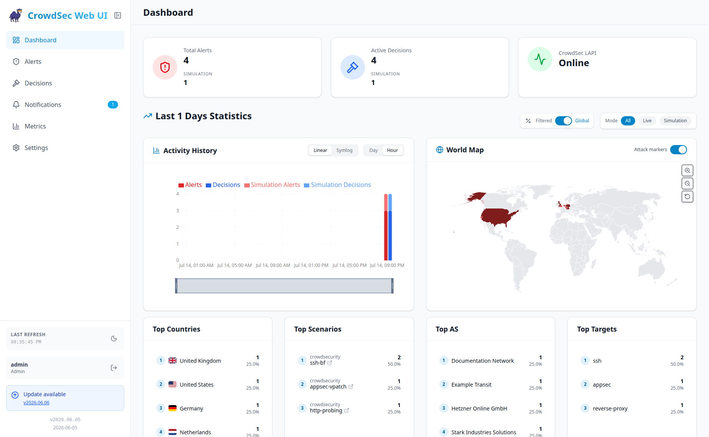
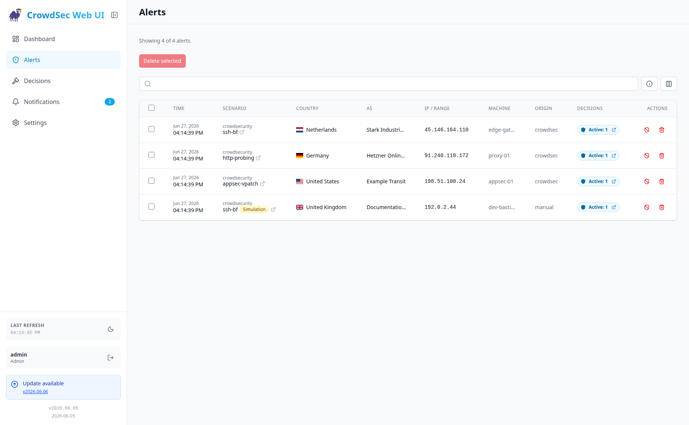
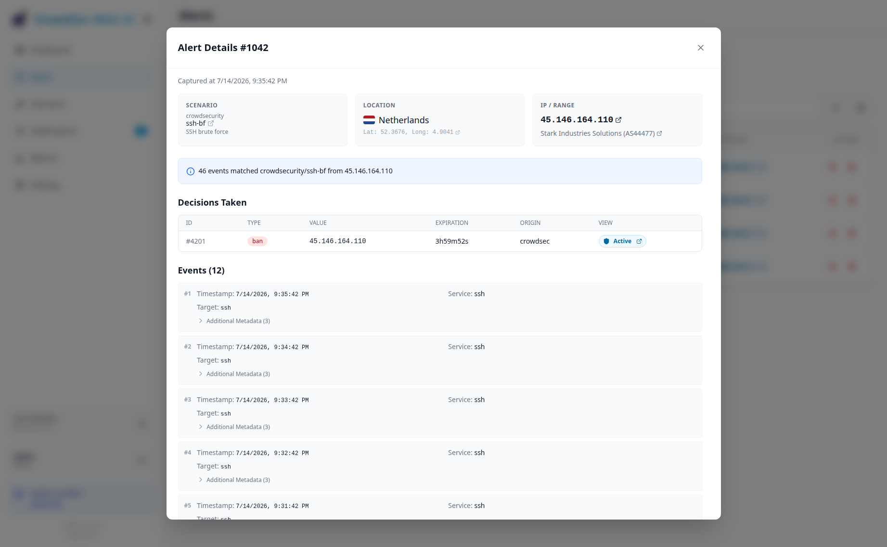
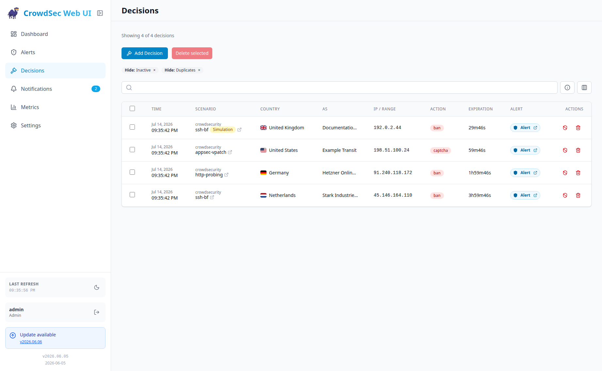
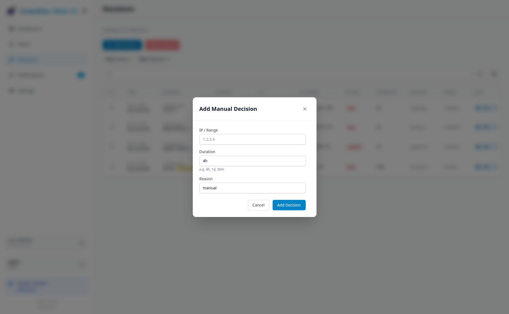

<div align="center">
  
</div>

<div align="center">

  [](https://github.com/TheDuffman85/crowdsec-web-ui/actions/workflows/release.yml)
  [](https://github.com/TheDuffman85/crowdsec-web-ui/actions/workflows/trivy-scan.yml)
  [](https://github.com/TheDuffman85/crowdsec-web-ui/blob/main/LICENSE)
  [](https://github.com/TheDuffman85/crowdsec-web-ui/commits/main)
  [](https://github.com/users/TheDuffman85/packages/container/package/crowdsec-web-ui)

</div>

# CrowdSec Web UI

A modern, responsive web interface for managing [CrowdSec](https://crowdsec.net/) alerts and decisions. Built with **React**, **Vite**, **Node.js**, and **Tailwind CSS**.

<div align="center">
  <a href="https://react.dev/"></a>
  <a href="https://vite.dev/"></a>
  <a href="https://tailwindcss.com/"></a>
  <a href="https://nodejs.org/"></a>
  <a href="https://www.docker.com/"></a>
</div>

## Features

### Dashboard
High-level overview of total alerts and live active decisions. Statistics and top lists with dynamic filtering, including simulation-mode visibility when enabled.

<a href="screenshots/dashboard.png">
  
</a>

### Alerts Management
View detailed logs of security events, including clear simulation-mode labeling.

<a href="screenshots/alerts.png">
  
</a>

### Alert Details
Detailed modal view showing attacker IP, AS information, location with map, and triggered events breakdown.

<a href="screenshots/alert_details.png">
  
</a>

### Decisions Management
View and manage active bans/decisions. Supports filtering by status (active/expired), simulation mode, and hiding duplicate decisions.

<a href="screenshots/decisions.png">
  
</a>

### Manual Actions
Ban IPs directly from the UI with custom duration and reason.

<a href="screenshots/add_decision.png">
  
</a>

### Update Notifications
Automatically detects new container images on GitHub Container Registry (GHCR). A badge appears in the sidebar when an update is available for your current tag.

### Notification Center
Create notification rules for alert spikes, alert thresholds, recent CVE activity, and application updates, then deliver them to one or more outbound destinations such as Email, Gotify, MQTT, ntfy, or Webhooks.

### Modern UI
-   **Dark/Light Mode**: Full support for both themes.
-   **Responsive**: Optimized for mobile and desktop.
-   **Real-time**: Fast interactions using modern React technology.

> [!CAUTION]
> **Security Notice**: This application **does not provide any built-in authentication mechanism**. It is NOT intended to be exposed publicly without protection. We strongly recommend deploying this application behind a reverse proxy with an Identity Provider (IdP) such as [Authentik](https://goauthentik.io/), [Authelia](https://www.authelia.com/), or [Keycloak](https://www.keycloak.org/) to handle authentication and authorization.

## Architecture

-   **Client**: React (Vite) + Tailwind CSS. Located in `client/`.
-   **Server**: Node.js (Hono). Acts as an intelligent caching layer for CrowdSec Local API (LAPI) with delta updates and optimized chunked historical data sync.
-   **Build Output**: The root build emits the frontend to `dist/client` and the compiled server to `dist/server`.
-   **Database**: SQLite (`better-sqlite3`). Persists alerts and decisions locally in `/app/data/crowdsec.db` to reduce memory usage and support historical data.
-   **Security**: The application runs as a non-root user (`node`) inside the container and communicates with CrowdSec via HTTP/LAPI. It uses **Machine Authentication** to obtain a JWT for full access (read/write), either via watcher `User/Password` or agent **mTLS**.

## Prerequisites

-   **CrowdSec**: A running CrowdSec instance.
-   **Authentication**: Configure exactly one CrowdSec LAPI auth mode for this web UI:

    1.  **Watcher password auth**
        Generate a secure password:
        ```bash
        openssl rand -hex 32
        ```
        Create the machine:
        ```bash
        docker exec crowdsec cscli machines add crowdsec-web-ui --password <generated_password> -f /dev/null
        ```

    2.  **Agent mTLS auth**
        Configure CrowdSec LAPI TLS auth and generate an agent client certificate/key pair for this Web UI as described in the [CrowdSec TLS authentication docs](https://docs.crowdsec.net/docs/local_api/tls_auth/).

> [!NOTE]
> The `-f /dev/null` flag is crucial. It tells `cscli` **not** to overwrite the existing credentials file of the CrowdSec container. We only want to register the machine in the database, not change the container's local config.

> [!IMPORTANT]
> Choose exactly one auth mode:
> - Password auth: `CROWDSEC_USER` + `CROWDSEC_PASSWORD`
> - mTLS auth: `CROWDSEC_TLS_CERT_PATH` + `CROWDSEC_TLS_KEY_PATH` with optional `CROWDSEC_TLS_CA_CERT_PATH`
>
> Do not set both modes at the same time. The container will fail fast on mixed or partial auth configuration.

### Trusted IPs for Delete Operations (Optional)

By default, CrowdSec may restrict certain write operations (like deleting alerts) to trusted IP addresses. If you encounter `403 Forbidden` errors when trying to delete alerts, you may need to add the Web UI's IP to CrowdSec's trusted IPs list.

**Docker Setup**: Add the Web UI container's network to the CrowdSec configuration in `/etc/crowdsec/config.yaml` or via environment variable:

```yaml
api:
  server:
    trusted_ips:
      - 127.0.0.1
      - ::1
      - 172.16.0.0/12  # Docker default bridge network
```

Or using `TRUSTED_IPS` environment variable on the CrowdSec container:
```bash
TRUSTED_IPS="127.0.0.1,::1,172.16.0.0/12"
```

See the [CrowdSec documentation](https://docs.crowdsec.net/docs/local_api/intro/) for more details on LAPI configuration.

### Simulation Mode Visibility

CrowdSec can run scenarios in **simulation mode**, where alerts and decisions are generated but no live remediation is applied. The Web UI can display those entries separately from real remediations.

- `CROWDSEC_SIMULATIONS_ENABLED=false` by default.
- When enabled, the UI shows simulation badges, simulation filters, and separate simulation counts on the dashboard.
- When left unset or set to `false`, the UI hides simulated alerts/decisions and the backend stops requesting simulated data from the CrowdSec LAPI.

### Machine Visibility

In multi-machine deployments, CrowdSec alerts can include `machine_id` and `machine_alias`. The Web UI can surface that information in the Alerts and Decisions tables, but it stays hidden for single-machine setups unless you explicitly force it on.

- `CROWDSEC_ALWAYS_SHOW_MACHINE=false` by default.
- When left unset or set to `false`, the UI enables machine visibility only after this app has observed more than one distinct non-empty `machine_id` during the current runtime.
- Set `CROWDSEC_ALWAYS_SHOW_MACHINE=true` to always show the Machine column/card, even before multiple machines have been observed.
- Displayed `machine` values prefer `machine_alias` and fall back to `machine_id`.

### Alert Allowlist Filtering

Some CrowdSec setups ingest very large volumes of alerts and decisions from external automation, third-party importers, bulk list sync jobs, or other custom workflows. In those cases, you may want the Web UI to focus on selected alert sources instead of caching everything exposed by the LAPI.

You can do that with these optional environment variables:

- `CROWDSEC_ALERT_ORIGINS`: comma-separated list of LAPI alert origins
- `CROWDSEC_ALERT_EXTRA_SCENARIOS`: comma-separated list of exact LAPI scenarios

```yaml
environment:
  - CROWDSEC_ALERT_ORIGINS=crowdsec
  - CROWDSEC_ALERT_EXTRA_SCENARIOS=manual/web-ui
```

This makes the backend fetch the union of:

- alerts whose LAPI `origin` is `crowdsec`
- alerts whose LAPI `scenario` is exactly `manual/web-ui`

You can adapt those values to match your own CrowdSec setup. For example:

- use `CROWDSEC_ALERT_ORIGINS` to keep only selected upstream origins
- use `none` inside `CROWDSEC_ALERT_ORIGINS` to also fetch the normal unfiltered alert feed
- use `CROWDSEC_ALERT_EXTRA_SCENARIOS` to include specific scenarios that should remain visible even if they come from a different origin
- multiple values can be provided as CSV, for example `CROWDSEC_ALERT_ORIGINS=crowdsec,cscli` or `CROWDSEC_ALERT_EXTRA_SCENARIOS=manual/web-ui,my/custom-scenario`

Examples:

- `CROWDSEC_ALERT_ORIGINS=CAPI` fetches only CAPI alerts
- `CROWDSEC_ALERT_ORIGINS=none,CAPI` fetches the normal unfiltered alert feed plus CAPI alerts

These are upstream LAPI filters, so excluded alerts are skipped before they are cached locally. This is usually more effective than relying on UI-side limits when you have very large external data sets.

## Run with Docker (Recommended)

1.  **Build the image**:
    ```bash
    docker build -t crowdsec-web-ui .
    ```

    You can optionally specify `DOCKER_IMAGE_REF` to override the default image reference used for checking updates (useful for forks or private registries):
    ```bash
    docker build --build-arg DOCKER_IMAGE_REF=my-registry/my-image -t crowdsec-web-ui .
    ```

> [!NOTE]
> Current Docker images are based on Node.js rather than Bun, so the previous Bun/AVX-specific x64 runtime limitation no longer applies.

2.  **Run the container**:
    Provide the CrowdSec LAPI URL and one supported auth mode.

    ```bash
    docker run -d \
      -p 3000:3000 \
      -e CROWDSEC_URL=http://crowdsec-container-name:8080 \
      -e CROWDSEC_USER=crowdsec-web-ui \
      -e CROWDSEC_PASSWORD=<your-secure-password> \
      -e CROWDSEC_SIMULATIONS_ENABLED=true \
      -e CROWDSEC_ALWAYS_SHOW_MACHINE=false \
      -e CROWDSEC_LOOKBACK_PERIOD=5d \
      -e CROWDSEC_REFRESH_INTERVAL=0 \
      -v $(pwd)/data:/app/data \
      --network your_crowdsec_network \
      crowdsec-web-ui
    ```
> [!NOTE]
> Ensure the container is on the same Docker network as CrowdSec so it can reach the URL.

### Docker Compose Example

```yaml
services:
  crowdsec-web-ui:
    image: ghcr.io/theduffman85/crowdsec-web-ui:latest
    container_name: crowdsec_web_ui
    ports:
      - "3000:3000"
    environment:
      - CROWDSEC_URL=http://crowdsec:8080
      - CROWDSEC_USER=crowdsec-web-ui
      - CROWDSEC_PASSWORD=<generated_password>
      # Optional: Include simulation-mode alerts/decisions from CrowdSec (default: false)
      - CROWDSEC_SIMULATIONS_ENABLED=true
      # Optional: Always show machine names instead of waiting for multiple machine_ids at runtime
      - CROWDSEC_ALWAYS_SHOW_MACHINE=false
      # Optional: Lookback period for alerts/stats (default: 168h/7d)
      - CROWDSEC_LOOKBACK_PERIOD=5d
      # Optional: Backend auto-refresh interval. Values: 0 (Off), 5s, 30s (default), 1m, 5m
      - CROWDSEC_REFRESH_INTERVAL=30s
      # Optional: Idle Mode settings to save resources
      # Interval to use when no users are active (default: 5m)
      - CROWDSEC_IDLE_REFRESH_INTERVAL=5m
      # Time without API requests to consider system idle (default: 2m)
      - CROWDSEC_IDLE_THRESHOLD=2m
      # Optional: Interval for full cache refresh (default: 5m)
      # Forces a complete data reload when active, skipped when idle.
      - CROWDSEC_FULL_REFRESH_INTERVAL=5m
      # Optional: Background retry delay for initial LAPI/bootstrap recovery (default: 30s)
      - CROWDSEC_BOOTSTRAP_RETRY_DELAY=30s
      # Optional: Enable automatic bootstrap retry after startup/login failure (default: true)
      - CROWDSEC_BOOTSTRAP_RETRY_ENABLED=true
      # Optional: Encryption key for notification destinations with saved secrets
      # - NOTIFICATION_SECRET_KEY=<long-random-secret>
      # Optional: Block notifications to private/internal destinations (default: true)
      # - NOTIFICATION_ALLOW_PRIVATE_ADDRESSES=false
      # Optional: Base path for reverse proxy deployments (e.g., /crowdsec)
      # - BASE_PATH=/crowdsec
    volumes:
      - ./data:/app/data
    restart: unless-stopped
```

### Docker Compose Example (mTLS Authentication)

```yaml
services:
  crowdsec-web-ui:
    image: ghcr.io/theduffman85/crowdsec-web-ui:latest
    container_name: crowdsec_web_ui
    ports:
      - "3000:3000"
    environment:
      - CROWDSEC_URL=https://crowdsec:8080
      - CROWDSEC_TLS_CERT_PATH=/certs/agent.pem
      - CROWDSEC_TLS_KEY_PATH=/certs/agent-key.pem
      # Optional: Custom CA bundle used to verify the CrowdSec LAPI server certificate
      - CROWDSEC_TLS_CA_CERT_PATH=/certs/ca.pem
      - CROWDSEC_SIMULATIONS_ENABLED=true
      - CROWDSEC_LOOKBACK_PERIOD=5d
    volumes:
      - ./data:/app/data
      - /path/on/host/agent.pem:/certs/agent.pem:ro
      - /path/on/host/agent-key.pem:/certs/agent-key.pem:ro
      - /path/on/host/ca.pem:/certs/ca.pem:ro
    restart: unless-stopped
```

### Using CrowdSec Web UI with a Local or Custom Certificate

If your CrowdSec Local API (LAPI) uses HTTPS with a self-signed certificate or an internal Certificate Authority (CA), the Web UI container may not trust it by default. This can result in errors like:

```
Login failed: unable to get local issuer certificate
```

#### Solution: Mount the CA Certificate and Use NODE_EXTRA_CA_CERTS

You can mount your CA certificate into the container and instruct Node.js to trust it using the `NODE_EXTRA_CA_CERTS` environment variable.

#### Example Docker Compose

```yaml
services:
  crowdsec-web-ui:
    image: ghcr.io/theduffman85/crowdsec-web-ui:latest
    container_name: crowdsec_web_ui
    ports:
      - "3000:3000"
    environment:
      - CROWDSEC_URL=https://crowdsec:8080
      - CROWDSEC_USER=crowdsec-web-ui
      - CROWDSEC_PASSWORD=<generated_password>
      - CROWDSEC_SIMULATIONS_ENABLED=true
      - NODE_EXTRA_CA_CERTS=/certs/root_ca.crt
    volumes:
      - ./data:/app/data
      - /path/on/host/root_ca.crt:/certs/root_ca.crt:ro
    restart: unless-stopped
```

#### Notes

- Replace `/path/on/host/root_ca.crt` with the path to your local CA certificate.
- The `:ro` ensures the certificate is mounted read-only.
- This method avoids rebuilding the container image.
- Works for self-signed certificates as well as private CA certificates.
- `NODE_EXTRA_CA_CERTS` is a general runtime trust mechanism. When using the new mTLS auth mode, prefer `CROWDSEC_TLS_CA_CERT_PATH` as the explicit CrowdSec LAPI trust input for the Web UI client connection.

### Reverse Proxy with Base Path

If you need to serve the Web UI at a non-root URL path (e.g., `https://example.com/crowdsec/` instead of `https://example.com/`), use the `BASE_PATH` environment variable.

#### Docker Compose Example

```yaml
services:
  crowdsec-web-ui:
    image: ghcr.io/theduffman85/crowdsec-web-ui:latest
    container_name: crowdsec_web_ui
    ports:
      - "3000:3000"
    environment:
      - CROWDSEC_URL=http://crowdsec:8080
      - CROWDSEC_USER=crowdsec-web-ui
      - CROWDSEC_PASSWORD=<generated_password>
      - CROWDSEC_SIMULATIONS_ENABLED=true
      - BASE_PATH=/crowdsec
    volumes:
      - ./data:/app/data
    restart: unless-stopped
```

#### Nginx Reverse Proxy Example

```nginx
location /crowdsec/ {
    proxy_pass http://localhost:3000/crowdsec/;
    proxy_http_version 1.1;
    proxy_set_header Host $host;
    proxy_set_header X-Real-IP $remote_addr;
    proxy_set_header X-Forwarded-For $proxy_add_x_forwarded_for;
    proxy_set_header X-Forwarded-Proto $scheme;
}
```

#### Notes

- The `BASE_PATH` must start with a `/` (e.g., `/crowdsec`, not `crowdsec`)
- Do not include a trailing slash (use `/crowdsec`, not `/crowdsec/`)
- When `BASE_PATH` is set, accessing the root URL (`/`) will redirect to the base path
- All API calls, assets, and navigation will automatically use the configured base path

### Health Check

The Docker image includes a built-in `HEALTHCHECK` that verifies the web server is responding. Docker will automatically mark the container as `healthy` or `unhealthy`.

Startup is non-blocking: if CrowdSec LAPI is temporarily unavailable, the Web UI stays up and continues retrying cache/bootstrap initialization in the background. This means the container can become `healthy` before the initial CrowdSec sync has completed.

**Endpoint:** `GET /api/health` (no authentication required)

```bash
curl http://localhost:3000/api/health
# {"status":"ok"}
```

The health check runs every 30 seconds with a 10-second start period to allow for initialization. You can check the container's health status with:

```bash
docker inspect --format='{{.State.Health.Status}}' crowdsec_web_ui
```

If you use `BASE_PATH`, the health check still targets `localhost:3000/api/health` directly inside the container, so no additional configuration is needed.

## Notifications

The **Notifications** page lets you define rules that watch the locally cached CrowdSec data and create notification events when a condition matches. Every notification is also stored in-app, where you can review delivery status and mark items as read.

### Rules

Each rule has:

-   a name
-   a severity: `info`, `warning`, or `critical`
-   incident-based deduplication so the same condition only fires once until it clears and reappears
-   one or more destination channels

Alert-based rules can also use optional filters for scenario text, target text, and whether simulated alerts should be included.

Available rule types:

-   `Alert Spike`: compares the current window with the previous window and triggers when the percentage increase and minimum alert count are exceeded
-   `Alert Threshold`: triggers when the number of matching alerts in the configured time window reaches the threshold
-   `Recent CVE`: extracts CVE IDs from matching alerts and checks publication age before notifying
-   `Application Update`: uses the built-in update check and triggers when a newer CrowdSec Web UI version is available

> [!NOTE]
> The `Recent CVE` rule queries the NVD API to determine when a CVE was published. If outbound access to `services.nvd.nist.gov` is blocked, recent-CVE notifications may be skipped.

### Destinations

You can create multiple destinations and attach the same rule to several of them.

Shared behavior:

-   destinations can be enabled or disabled independently
-   secrets are masked when you reopen a saved destination
-   destinations with saved secrets are encrypted at rest using `NOTIFICATION_SECRET_KEY`, or an auto-generated key persisted in app metadata when the env var is unset
-   **Send Test** validates a saved destination without waiting for a real rule to fire
-   delivery results are stored with each notification as `delivered` or `failed`
-   private, loopback, and link-local outbound destinations are allowed by default and can be blocked explicitly

Supported destination types:

#### Email

SMTP delivery with:

-   `SMTP Host`
-   `SMTP Port`
-   `SMTP Security`: `Plain SMTP`, `STARTTLS`, or `SMTPS / Implicit TLS`
-   optional `SMTP User` and `SMTP Password`
-   `From Address`
-   one or more comma-separated `To Address(es)`
-   `Importance`: `auto`, `normal`, or `important`
-   optional `Allow insecure TLS` for trusted self-signed SMTP endpoints

When email importance is set to `auto`, it follows the rule severity:

-   `info` -> `normal`
-   `warning` -> `important`
-   `critical` -> `important`

#### Gotify

Gotify delivery with:

-   `Gotify URL`
-   `App Token`
-   `Priority`: `auto` or an explicit integer

When Gotify priority is set to `auto`, it follows the rule severity:

-   `info` -> `5`
-   `warning` -> `7`
-   `critical` -> `10`

#### ntfy

ntfy delivery with:

-   `Server URL`
-   `Topic`
-   optional `Access Token`
-   `Priority`: `auto`, `min`, `low`, `default`, `high`, or `urgent`

When ntfy priority is set to `auto`, it follows the rule severity:

-   `info` -> `default`
-   `warning` -> `high`
-   `critical` -> `urgent`

#### MQTT

MQTT delivery is generic publish-only notification output. It does **not** include Home Assistant discovery, entity sync, or command handling.

MQTT settings:

-   `Broker URL`
-   optional `Username` and `Password`
-   optional `Client ID`
-   `QoS`: `0` or `1`
-   `Keepalive`
-   `Connect Timeout`
-   `Topic`
-   `Retain MQTT payloads`

Each notification publishes a JSON payload to the configured topic containing:

-   `title`
-   `message`
-   `severity`
-   `metadata`
-   `sent_at`
-   `channel_id`
-   `channel_name`
-   `channel_type`
-   `rule_id`
-   `rule_name`
-   `rule_type`

For test sends, the rule fields are `null`.

#### Webhook

Webhook delivery supports custom integrations such as automation tools, internal APIs, chat bridges, and other HTTP endpoints.

Webhook settings:

-   HTTP method: `POST`, `PUT`, or `PATCH`
-   target `URL`
-   optional query parameters
-   optional custom headers
-   authentication: none, bearer token, or basic auth
-   body mode: `JSON`, `Text`, or `Form`
-   request timeout
-   retry attempts and retry delay
-   optional `Allow insecure TLS` for trusted self-signed HTTPS endpoints

Webhook templates support simple dotted variables rooted at `event.*`. The body and templated fields can reference values such as:

-   `{{event.title}}`
-   `{{event.message}}`
-   `{{event.severity}}`
-   `{{event.metadata}}`
-   `{{event.sent_at}}`
-   `{{event.channel_name}}`
-   `{{event.rule_name}}`

### Notification Security Controls

-   `NOTIFICATION_SECRET_KEY`: optional override for the notification encryption key. If unset, the backend auto-generates one on first start and persists it in application metadata so encrypted destinations continue working across restarts.
-   `NOTIFICATION_ALLOW_PRIVATE_ADDRESSES=true` by default. Set it to `false` if you want to block private, loopback, and link-local destinations.

### Current Scope

The notification system currently supports:

-   in-app notification history
-   rule-based outbound delivery
-   Email, Gotify, MQTT, ntfy, and Webhook destinations

It currently does **not** include:

-   Telegram destinations
-   Home Assistant MQTT discovery
-   MQTT entity state publishing or inbound commands

### Run with Helm

A Helm chart for deploying `crowdsec-web-ui` on Kubernetes is available (maintained by the zekker6):
[https://github.com/zekker6/helm-charts/tree/main/charts/apps/crowdsec-web-ui](https://github.com/zekker6/helm-charts/tree/main/charts/apps/crowdsec-web-ui)

## Persistence & Alert History

All data is stored in a single SQLite database at `/app/data/crowdsec.db`. To persist data across container restarts, mount the `/app/data` directory.

**Docker Run:**
Add `-v $(pwd)/data:/app/data` to your command.

**Docker Compose:**
Add the volume mapping:
```yaml
volumes:
  - ./data:/app/data
```

### How It Works

The Web UI maintains its own local history of alerts and decisions. Data fetched from the CrowdSec LAPI is stored in the local database and **preserved across restarts and full refreshes**. This means the Web UI can retain more alerts than the LAPI itself keeps (LAPI has a configurable `max_items` limit, default 5000).

- Alerts are kept for the duration of `CROWDSEC_LOOKBACK_PERIOD` (default: 7 days), then automatically cleaned up.
- On restart, existing data is reused and new data from LAPI is merged in.
- If LAPI is unavailable during startup, the Web UI keeps retrying bootstrap in the background using `CROWDSEC_BOOTSTRAP_RETRY_DELAY` until it can initialize automatically.
- To force a full cache reset, use the `POST /api/cache/clear` endpoint.

## Local Development

1.  **Install Dependencies**:
    You need Node.js `24.14.1` and pnpm `10.33.0` installed locally.
    ```bash
    pnpm install
    ```

2.  **Configuration**:
    Create a `.env` file in the root directory with your CrowdSec credentials:
    ```bash
    CROWDSEC_URL=http://localhost:8080
    CROWDSEC_USER=crowdsec-web-ui
    CROWDSEC_PASSWORD=<your-secure-password>
    CROWDSEC_SIMULATIONS_ENABLED=true
    CROWDSEC_REFRESH_INTERVAL=30s
    CROWDSEC_BOOTSTRAP_RETRY_DELAY=30s
    CROWDSEC_BOOTSTRAP_RETRY_ENABLED=true
    # Optional: Base path for reverse proxy deployments
    # BASE_PATH=/crowdsec
    ```

    Or use mTLS instead of `CROWDSEC_USER`/`CROWDSEC_PASSWORD`:
    ```bash
    CROWDSEC_URL=https://localhost:8080
    CROWDSEC_TLS_CERT_PATH=/path/to/agent.pem
    CROWDSEC_TLS_KEY_PATH=/path/to/agent-key.pem
    # Optional when using a private CA or self-signed CrowdSec LAPI certificate
    CROWDSEC_TLS_CA_CERT_PATH=/path/to/ca.pem
    CROWDSEC_SIMULATIONS_ENABLED=true
    CROWDSEC_REFRESH_INTERVAL=30s
    ```

3.  **Start the Application**:
    You can either use the root pnpm scripts directly or the helper script `run.sh`.

    **Development Mode with pnpm**:
    Starts both server (port 3000) and client (port 5173).
    ```bash
    pnpm run dev
    ```

    **Production Build with pnpm**:
    Builds the client and compiled server output.
    ```bash
    pnpm run build
    ```

    **Production Start with pnpm**:
    Starts the compiled server from `dist/server`. This is the same startup contract used by the Docker image via `pnpm start`.
    ```bash
    pnpm start
    ```

    **Development Mode with helper script**:
    Starts both server (port 3000) and client (port 5173).
    ```bash
    ./run.sh dev
    ```

    **Production Mode with helper script**:
    Builds the application and starts the server (port 3000).
    ```bash
    ./run.sh
    ```

## Star History

[](https://star-history.com/#TheDuffman85/crowdsec-web-ui&Date)
